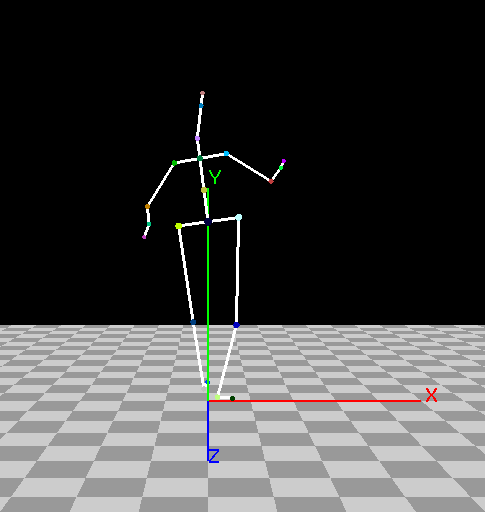
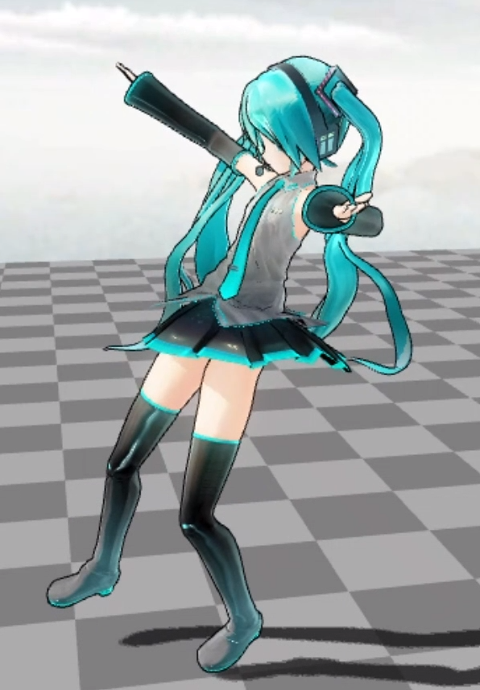

# Readme

We provide a tool that converts 3D bone points sequence into a .bvh file that is used for visualization.

We also collect some BVH visualization tools.

##  convert 3D bone points sequence into .bvh file

In `./3Dpoints2BVH`

**reference:**

https://github.com/HW140701/VideoTo3dPoseAndBvh

**3D bone points sequence data format:**

the sequence of the points should be store in an array of shapes [length,21,3], where the first dimension is the length of the sequence.

The 21 3D point coordinates are bounded with different bone points in the following order,  you can write a simple script that works on your data (in `./3Dpoints2BVH/run.py`, we write a  function  `getStandardFrames`  to convert our sample data into the standard format):

```
'Hips': 0,
'RightUpLeg': 1,
'RightLeg': 2,
'RightFoot': 3,
'LeftUpLeg': 4,
'LeftLeg': 5,
'LeftFoot': 6,
'Spine': 7,
'Spine3': 8,
'Neck': 9,
'Head': 10,
'LeftArm': 11,
'LeftForeArm': 12,
'LeftHand': 13,
'RightArm': 14,
'RightForeArm': 15,
'RightHand': 16,
'LeftWristEndSite': 17,
'RightWristEndSite': 18,
'LeftToe': 19,
'RightToe': 20
```


We also provide a sample 3D points .json file `Besame_Mucho.json` and the corresponding .bvh file `test.bvh` in  `./3Dpoints2BVH`


**run:**

```
cd 3Dpoints2BVH
python run.py --input_json ./input.json --output_bvh ./test.bvh
```

## A simple .bvh  file viewer：

In `./BvhViewer`，we collect a bvhviewer that simply visualizes .bvh file, we use this tool for debugging.

**reference：**

https://download.csdn.net/detail/dxth06/3508439




the bvhviewer in https://github.com/mrzli/bvhviewer  can do the same work.

## 3D Model and bvh sample：

In `./model`    we provide a  pmx 3D model  and `.bvh` file sample

## visualization tool

In `./liveAnimation`  , install the application by instruction，then run `liveAnimation.exe`，firstly, load the pmx model , then load `.bvh motion file, then enjoy it!  :)


